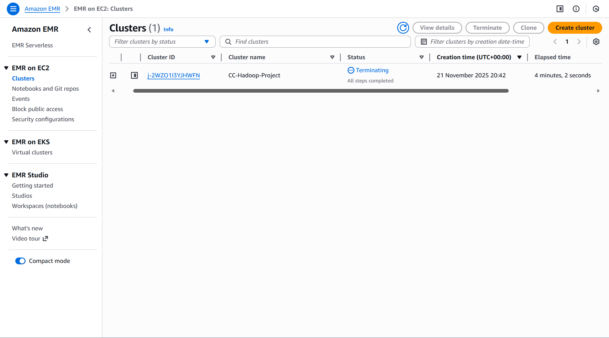
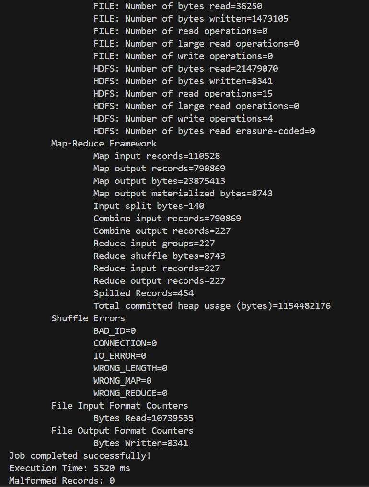
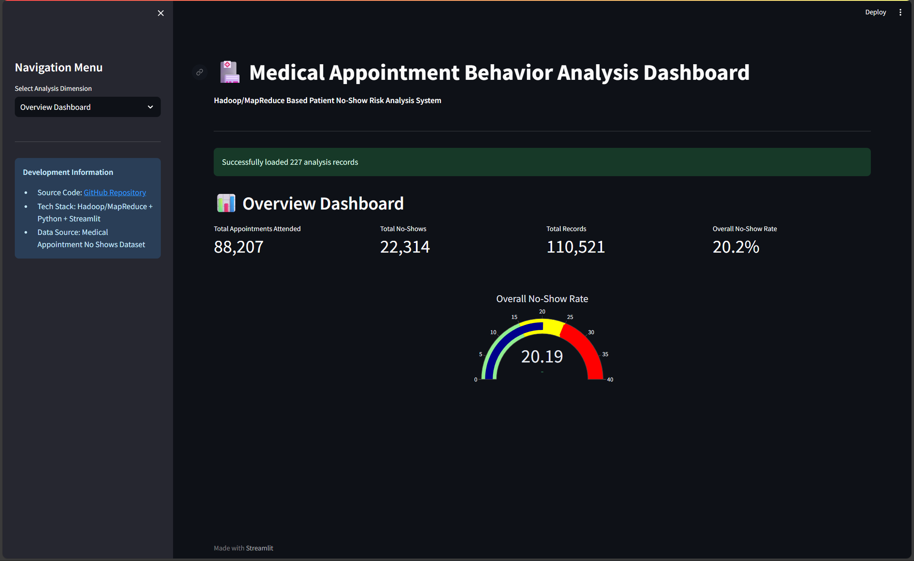
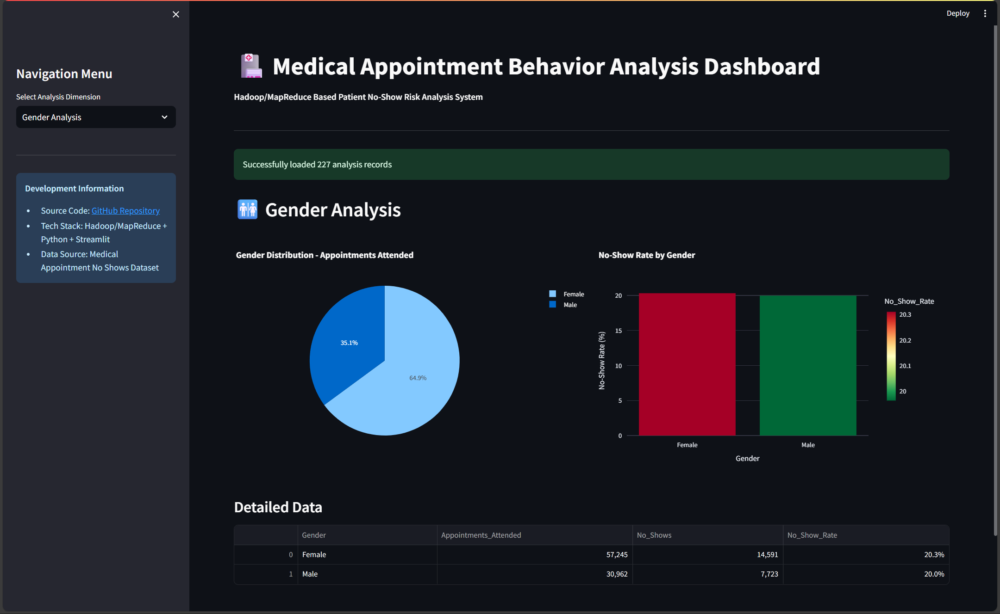
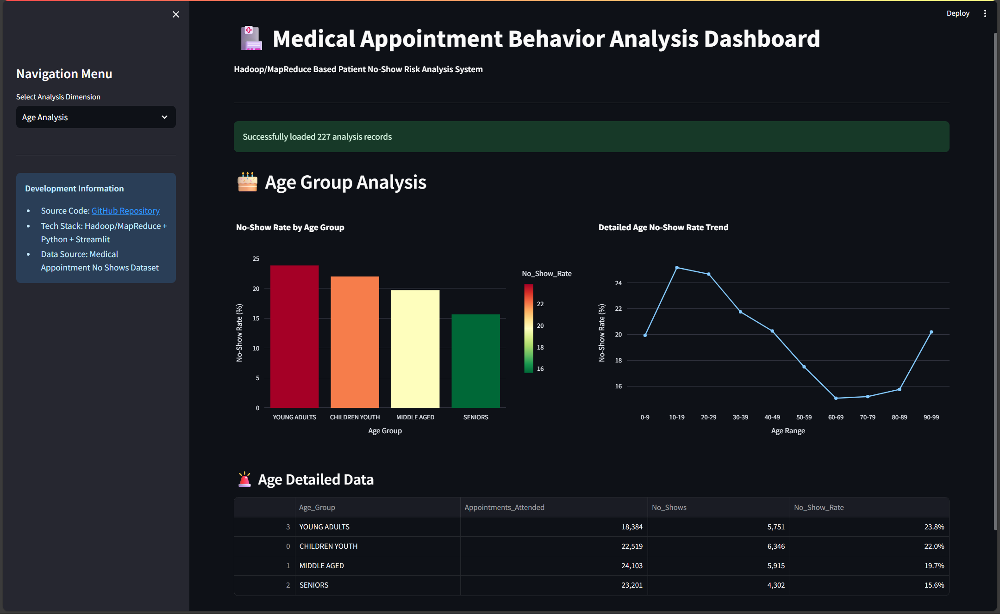
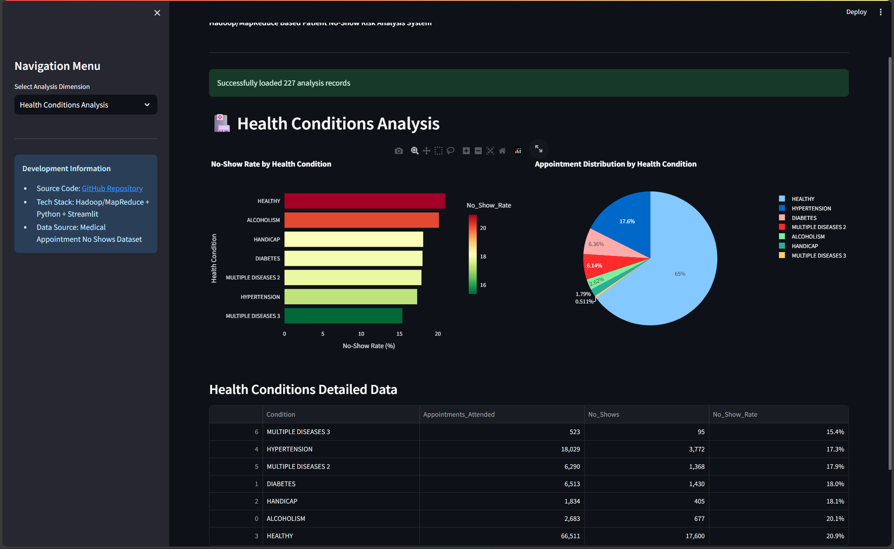
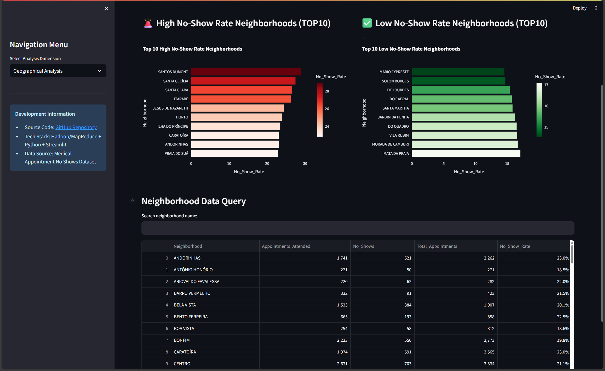
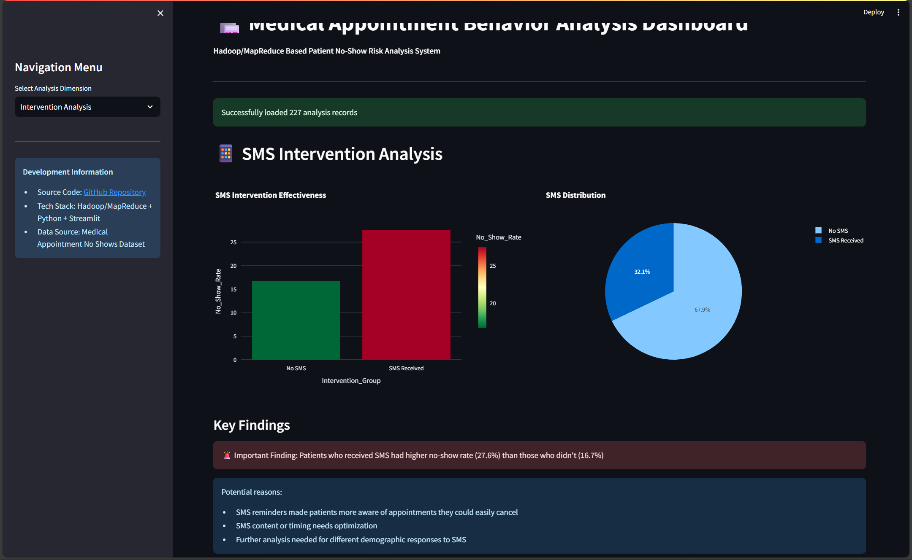
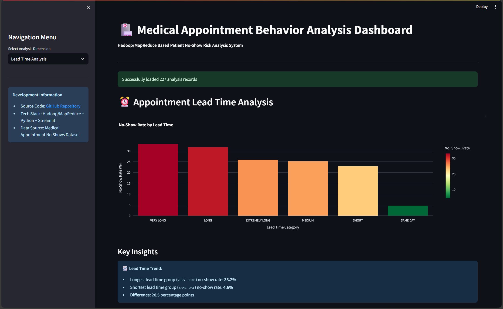

# Deploy Remotely
## Amazon EMR Cluster (additional minor cost introduced, results already saved, optional)
### Unzip Data
```bash
unzip data/archive.zip -d data/ && mv data/KaggleV2-May-2016.csv data/medical_appointments.csv
```
### Install AWS CLI and Configure
Follow instructions at
https://docs.aws.amazon.com/cli/latest/userguide/getting-started-install.html
**Configure AWS CLI with your credentials**
```bash
aws configure
```
### Verify Identity
```bash
aws sts get-caller-identity
```
### Create S3 Bucket and Upload Data
```bash
aws s3 mb s3://zeli8888-cc-project --region eu-west-1 \
&& aws s3 cp ./data/medical_appointments.csv s3://zeli8888-cc-project/ \
&& aws s3 cp ./ccproject/ccproject-1.0-SNAPSHOT.jar s3://zeli8888-cc-project/ \
&& aws s3 ls s3://zeli8888-cc-project/
```
### Create EMR Cluster and Run Job
**Remove previous results if any**
```bash
aws s3 rm s3://zeli8888-cc-project/results/ --recursive
```
**Create default roles if not exist**
```bash
aws emr create-default-roles
```
**Create EMR Cluster and Run Job**
```bash
aws emr create-cluster \
    --name "CC-Hadoop-Project" \
    --release-label emr-6.15.0 \
    --instance-type m4.large \
    --instance-count 1 \
    --use-default-roles \
    --region eu-west-1 \
    --auto-terminate \
    --steps Type=CUSTOM_JAR,Name=PatientAnalysis,Jar=s3://zeli8888-cc-project/ccproject-1.0-SNAPSHOT.jar,Args=[zeli8888.ccproject.patient_behavior.PatientDemographicsAnalysis,s3://zeli8888-cc-project/medical_appointments.csv,s3://zeli8888-cc-project/results/]
```
### Monitor Cluster and Job
**List Active Clusters**
```bash
aws emr list-clusters --active --region eu-west-1
```
**Get Cluster ID and Export as Environment Variable**
```bash
export CLUSTER_ID=YOUR_CLUSTER_ID
```
**Monitor Steps**
```bash
aws emr list-steps --cluster-id $CLUSTER_ID --region eu-west-1
```
**Wait for cluster to be terminated automatically after job completion**
```bash
aws emr describe-cluster --cluster-id $CLUSTER_ID --region eu-west-1 --query 'Cluster.[Status.State, Status.Timeline.EndDateTime]'
```

### Get Results
```bash
aws s3 cp s3://zeli8888-cc-project/results/part-r-00000 ./aws_emr_results.txt && cat aws_emr_results.txt
```
```bash
aws s3 rb s3://zeli8888-cc-project --force --region eu-west-1
```
## Dashboard Analysis
**Access via https://zeli8888-cc-medical-dashboard.streamlit.app/**
---
# Deploy locally
## Run Hadoop (results already saved, optional)
### Unzip Data
```bash
unzip data/archive.zip -d data/ && mv data/KaggleV2-May-2016.csv data/medical_appointments.csv
```
### Start Hadoop Container (large image, for learning and local test)
```bash
docker run -d -p 9870:9870 -p 8088:8088 -p 8080:8080 -p 18080:18080 -p 9000:9000 -p 8888:8888 -p 9864:9864 -v ${PWD}:/root/ipynb --name cc-spark-jupyter-pig zeli8888/spark-jupyter-pig
```
### Go into Container
```bash
docker exec -it cc-spark-jupyter-pig /bin/bash
```
### Upload Dataset to HDFS
```bash
hdfs dfs -mkdir -p /patient_no_show_analysis/raw_data \
&& hdfs dfs -put -f /root/ipynb/data/medical_appointments.csv /patient_no_show_analysis/raw_data/ \
&& hdfs dfs -rm -r /patient_no_show_analysis/results/patient_demographics 2>/dev/null
```
### Run Analysis Jobs
```bash
hadoop jar /root/ipynb/ccproject/ccproject-1.0-SNAPSHOT.jar \
    zeli8888.ccproject.patient_behavior.PatientDemographicsAnalysis \
    /patient_no_show_analysis/raw_data \
    /patient_no_show_analysis/results/patient_demographics
```

### Get Results
```bash
hdfs dfs -get -f /patient_no_show_analysis/results/patient_demographics/part-r-00000 /root/ipynb/patient_demographics_results.txt
```

## Dashboard Analysis
```bash
docker run -d -p 8501:8501 -v ./patient_demographics_results.txt:/app/patient_demographics_results.txt --name cc-dashboard zeli8888/cc-medical-dashboard
```
**Access via http://localhost:8501**
## Demo
       